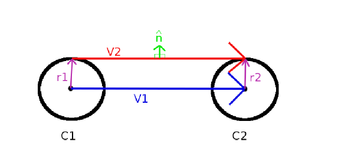
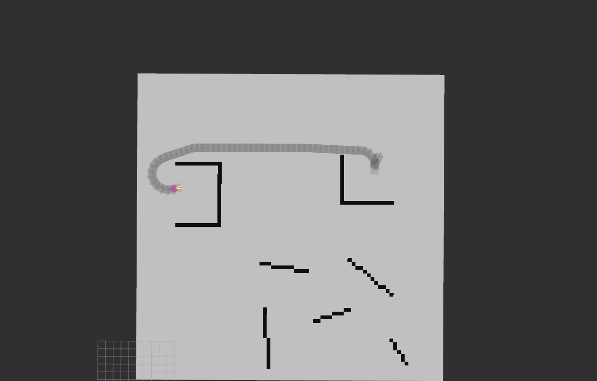

# hybrid-a-star

## 依赖

- Ubuntu 18.04
- ROS Melodic

## Ros Graph

## 车辆模型:

$(x,y)$: 车辆定位位置，在后轴中心处

$\theta$: 车辆的朝向

$L$:  轴距

$\rho$:  转弯半径

$$
\begin{bmatrix}
\dot{x} \\
\dot{y} \\
\dot{\theta}
\end{bmatrix} =
v \begin{bmatrix}
\cos\theta \\
\sin\theta \\
\frac{\tan{\phi}}{L}
\end{bmatrix}
$$
更新方程:

$$
\begin{bmatrix}
x_{k+1} \\
y_{k+1} \\
\theta_{k+1}
\end{bmatrix}
=
\begin{bmatrix}
x_k + \Delta s\cos\theta \\
y_k + \Delta s\sin\theta \\
\theta_k + \frac{\Delta s}{L} * \tan\phi_k
\end{bmatrix}
$$

$\Delta s = v\Delta t$:  机器人运动距离,

##  算法

### Dubin Curve

假设车辆的起点为 $q_I$, 终点为$q_F$,  那么求解最短路径可以写成求解如下优化问题：
$$
\min L(q,u) = \min \int_0^{t_F} \sqrt{\dot{x}(t)^2 + \dot{y}(t)^2} \text{d}t
$$
假设车辆运行速度恒定，那么，（3）式中的代价函数 $L(q, u)$ 只与 $t_F$ 相关。

已经证明，给定任意的起点和终点，Dubin car的最短路径总是可以表示为不超过三种的motion primitives.

Dubin car 的action 只有 $u\in\{-1, 0, 1\}$. 并且可以证明，只有六种motion primitives 是最优的。
$$
\{L_\alpha R_\beta L_\gamma, R_\alpha L_\beta R_\gamma,L_\alpha S_d L_\gamma,L_\alpha S_dR_\gamma,R_\alpha S_d L_\gamma,R_\alpha S_d R_\gamma\}
$$
其中 $\alpha\in [0, 2\pi), \gamma \in [0, 2\pi), \beta \in (\pi, 2\pi), d \geq 0$.

#### 计算Dubin 路径

***向量法计算切线***

1. 给定两个圆$C_1, C_2$, 圆心分别是$p_1, p_2$;

2. 连接$p_1, p_2$, 构造向量$\vec{V_1}$, 向量的模长为$D$;

3. 绘制两个圆的公切线, 如上图所示为$\vec{V_2} = p_{\text{opt}2} - p_{\text{opt}1}$.

4. 绘制$\vec{V_2}$ 的法向量，$\hat{n}$, 为单位向量。

5. 向量之间的关系：

   -  $\vec{V_2} \cdot \hat{n} = 0$, 

   - $\hat{n} \cdot \hat{n} = 1$

   - 修改$\vec{V_1}, 使得 $$\vec{V_1} ,\vec{V_2}$ 平行： $\vec{V_1^t} = \vec{V_1} + (r_2 - r_1)\hat{n}$.

   - 所以
     $$
     \hat{n} \cdot \vec{V_1^t} = \hat{n} \cdot (\vec{V_1} + (r_2 - r_1)\cdot \hat{n}) = 0
     $$
     得到 
     $$
     \hat{n} \cdot \vec{V_1} = r_1 - r_2
     $$
     两边同除以$D$,得到
     $$
     \hat{V_1} \cdot \hat{n} = \frac{r_1 - r_2}{D}
     $$
     其中 $\hat{V_1} = \vec{V_1} /D$.

     令$c = \frac{r_1 -r_2}{D}$, 为 $\vec{V_1}, \hat{n}$ 的夹角的余弦值。

     因此可以从$\hat{V_1}$ 旋转$\arccos c$ 得到$\hat{n}$.

     假设$\hat{n} = [n_x, n_y]^T$, $\hat{V_1} = [v_{1x}, v_{1y}]^T$.

     因此有
     $$
     n_x = v_{1x} c - v_{1y} \sqrt{1-c^2} \\
     n_y = v_{1z} \sqrt{1-c^2} + v_{1y} c
     $$
     那么如计算切点$p_{\text{opt}1,2}$ 呢？ 
     $$
     p_{\text{opt}1,x} - x_1 = r_1 \times n_x \\
     p_{\text{opt}2,y} - y_1 = r_1 \times n_y
     $$
     $x_1, y_1$ 为$C_1$ 的圆心。

     同理可以计算$p_{\text{opt}2}$. 

     

***计算CSC路径***

### Reeds-Shepp Curves

## Results

## Future Works

- [ ] path smooth

- [ ] assign velocity profile

